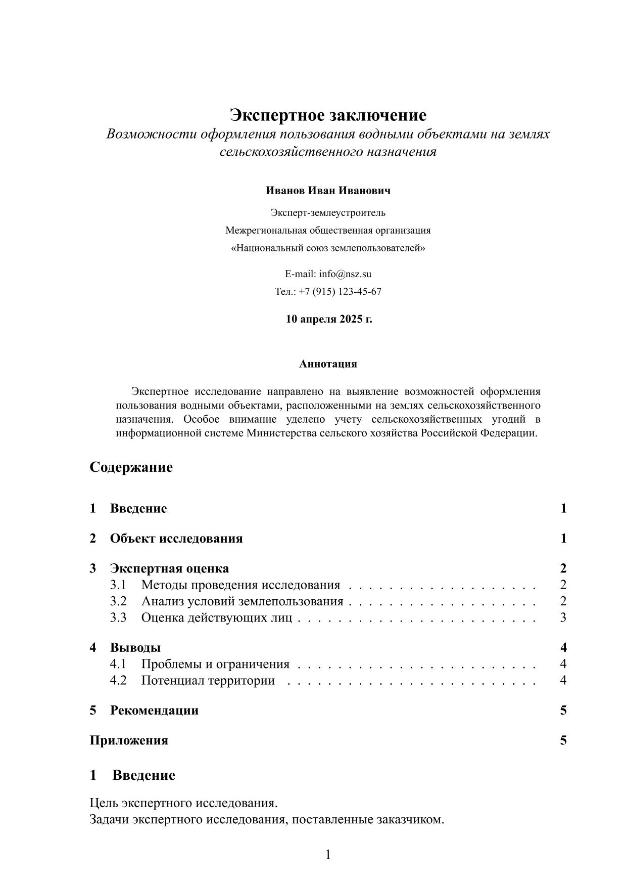

# Шаблон экспертного заключения для LaTeX




Этот репозиторий содержит профессиональный шаблон для оформления экспертных заключений, отчетов и исследовательских документов в системе LaTeX.

## Особенности шаблона

- **Готовый титульный лист** с логотипом организации и контактными данными
- **Структурированный контент** с разделами: введение, объект исследования, экспертная оценка, выводы, рекомендации
- **Гибкая система списков** с поддержкой многоуровневой вложенности
- **Встроенные команды** для вставки изображений с автоматической проверкой наличия файлов
- **Полноценная библиография** с поддержкой нормативных документов
- **Адаптивный дизайн** с правильными отступами и типографикой
- **Скрипты автоматизации** для удобной сборки документа

## Структура файлов

```
├── images/                    # Папка для изображений и графики
│   ├── logo.png               # Логотип организации
├── scripts/                   # Скрипты для автоматизации сборки
│   ├── build.py               # Основной скрипт сборки
│   ├── md_tex.py              # Конвертер Markdown в LaTeX
│   └── dist/                  # Исполняемые файлы
│       ├── build.exe          # Исполняемый файл сборки
│       └── md_tex.exe         # Исполняемый конвертер
├── advanced_image_template.sty # Пакет для работы с изображениями
├── bibpage.tex                # Библиография и нормативные документы
├── content.tex                # Основное содержание документа
├── main.tex                   # Главный файл для компиляции
├── metadata.tex               # Файл с настройками титульной страницы, заголовка, дат
├── packages.tex               # Настройки пакетов и стилей
├── primer.tex                 # Примеры использования элементов
└── titlepage.tex              # Шаблон титульного листа
```

## Требования

Для работы с шаблоном необходимо:
- Установленный дистрибутив LaTeX (TeX Live, MiKTeX или аналогичный)
- Python 3.x (для работы скриптов автоматизации)
- Для запуска исполняемых EXE файлов установка Python не требуется
- Возможность компиляции с XeLaTeX или LuaLaTeX (для поддержки современных шрифтов)

## Использование

### Базовый способ (вручную)
1. Клонируйте репозиторий или скачайте архив
2. Отредактируйте файлы `titlepage.tex` и `content.tex` под свои нужды
3. Добавьте свои изображения в папку `images/`
4. Скомпилируйте документ командой:
   ```
   xelatex main.tex
   ```

### Автоматизированный способ (с использованием скриптов)
1. Для сборки документа выполните:
   ```
   python md_tex.py из папки Scripts или запустите md_tex.exe из папки Scripts\dist
   ```
   
2. Для конвертации md файла в tex (конвертируется только основной текст без преамбулы tex):

   ```
   python build.py из папки Scripts или запустите build.exe из папки Scripts\dist
   ```

## Примеры использования

### Вставка изображения  с подписью и ссылкой на него
```tex
На Рисунке~\ref{fig:example} показан пример изображения.

\begin{figure}[h]
    \centering
    \includegraphics[width=0.5\textwidth]{images/example.jpg}
    \caption{Пример изображения с подписью.}
    \label{fig:example}
\end{figure}\insertimage{images/scheme.pdf}{Подпись к изображению}
\insertimage[width=0.5\textwidth]{images/photo.jpg}{Изображение с измененным размером}
```

### Вставка изображения  с подписью

```tex
% Изображение из локальной папки 'images'
\centering
\includegraphics[width=0.8\textwidth]{images/example.jpg} % Путь к файлу
\captionof{figure}{Пример изображения с подписью без использования figure.} % Подпись
\label{fig:mylabel} % Метка для ссылки

% Ссылка в тексте
На Рис.~\ref{fig:mylabel} показан пример.

% Альтернативный вариант (если нет caption):
\begin{center}
  \includegraphics[width=0.6\textwidth]{images/example.jpg} \\
  \small\textit{Рис. 1: Пример подписи вручную.}
\end{center}
```

### Три  изображения в ряд

```tex
\begin{minipage}[t]{0.3\textwidth}
    \includegraphics[width=\textwidth]{images/photo.jpg}
    \captionof{figure}{Ситуация}
\end{minipage}
\begin{minipage}[b]{0.3\textwidth}
    \includegraphics[width=\textwidth]{images/photo2.jpg}
    \captionof{figure}{Фотография}
\end{minipage}
\begin{minipage}[c]{0.3\textwidth}
    \includegraphics[width=\textwidth]{images/photo3.pdf}
    \captionof{figure}{Обложка}
\end{minipage}
```

### Многоуровневые списки

```tex
\begin{enumerate}
    \item[1.] Первый уровень:
    \begin{itemize}
        \item[а)] второй уровень (маркированный);
        \item[б)] еще один пункт.
    \end{itemize}
    \item[2.] Снова первый уровень (нумерованный).
\end{enumerate}
```

### Таблица с заголовком и ссылкой

```tex
% Сыылка на таблицу в тексте:
В Таблице~\ref{tab:example} представлены данные.

\begin{table}[htbp]
    \centering
    \caption{Название таблицы.}
    \label{tab:example}
    \begin{tabular}{|l|c|r|}
        \hline
        \textbf{Заголовок 1} & \textbf{Заголовок 2} & \textbf{Заголовок 3} \\
        \hline
        Данные 1 & Данные 2 & Данные 3 \\
        \hline
    \end{tabular}
\end{table}
```


### Оформление списка использованной литературы в файле  bibpage.tex

```tex
% ссылка на источник в тектсте
В работе использованы методики, описанные в \cite{Butyrin2007}, 
а также требования \cite{SP42.13330.2016}.

\bibitem{Butyrin2007}
Бутырин А.Ю. 
\textit{Методики исследования объектов судебной строительно-технической экспертизы: межевых границ земельных участков. Методика утверждена научно-методическим советом Российского федерального центра судебной экспертизы при Минюсте России.}. 
М., 2007.
\bibitem{SP42.13330.2016}
СП 42.13330.2016. Свод правил. Градостроительство. Планировка и застройка городских и сельских поселений. 
Актуализированная редакция СНиП 2.07.01-89* (утв. Приказом Минстроя России от 30.12.2016 № 1034/пр) (ред. от 19.12.2019).
```

## Параметры документа для WORD

### **1. Общие параметры страницы**
- **Размер бумаги**: A4.
- **Поля**:
  - Левое: 3 см.
  - Правое: 2 см.
  - Верхнее и нижнее: по 2 см.
- **Шрифт основного текста**: Times New Roman, 13 pt.
- **Междустрочный интервал**: 1.2 (аналог `15.6pt` для 13pt шрифта в LaTeX).
- **Выравнивание**: по ширине (как в LaTeX).

---

### **2. Форматирование текста**
- **Основной текст**:
  - Шрифт: Times New Roman, 13 pt.
  - Цвет: чёрный (если не указано иное).
  - Переносы: разрешены, но с контролем (аналог `\hyphenpenalty=1000`).
- **Дополнительные размеры шрифта**:
  - `\small`: 11 pt.
  - `\footnotesize`: 10 pt.
  - `\large`: 14 pt.
- **Абзацы**:
  - Отступ первой строки: 1.25 см (стандарт для Word).
  - Интервалы между абзацами: 0.5 строки (аналог `topsep` в LaTeX).

---

### **3. Заголовки**
- **Формат**:
  - Использовать стили Word (Заголовок 1, Заголовок 2 и т.д.).
  - Шрифт: Times New Roman, полужирный.
  - Размеры (на основе LaTeX-логики):
    - Заголовок 1: 14 pt (`\large`).
    - Заголовок 2: 13 pt (`\normalsize`).
    - Заголовок 3: 11 pt (`\small`).
  - Интервалы: 6 pt до и после заголовка (аналог `topsep`).
- **Нумерация**: сквозная или многоуровневая, в зависимости от структуры.

---

### **4. Списки**
- **Маркированные списки**:
  - Без маркеров (аналог `label={}` в LaTeX).
  - Отступ слева: 1.5 см (`leftmargin=1.5em`).
  - Интервал между пунктами: 0.25 строки (`itemsep`).
- **Нумерованные списки**:
  - Без автоматической нумерации (если требуется, использовать ручной ввод).
  - Отступ слева: 2 см (`leftmargin=2em`).
- **Описания** (например, термины):
  - Выравнивание: по левому краю.
  - Отступ: 2 см.

---

### **5. Дополнительные элементы**
- **Таблицы**:
  - Использовать стиль "Сетка таблицы" (аналог `booktabs` в LaTeX).
  - Шрифт: Times New Roman, 10–11 pt.
  - Горизонтальные линии только для заголовков и итогов (аналог `\toprule`, `\midrule`).
- **Изображения**:
  - Обтекание: "В тексте" или "Квадрат".
  - Подписи: шрифт 11 pt, выравнивание по центру.
- **Абстракт/аннотация**:
  - Шрифт: 11 pt, курсив, с отступами сверху и снизу.

---

### **6. Особые требования**
- **Переносы**:
  - Автоматические, но с ограничением (аналог `\emergencystretch`).
  - Не разрывать технические термины или имена.
- **Микротипографика**:
  - Кернинг: включить (в Word: "Разметка страницы" → "Расширенные параметры шрифта").
  - Сжатие пробелов: 0.5–1 pt (аналог `microtype`).

---

### **7. Проверка**
- Убедиться, что все стили применены единообразно.
- Проверить поля и разметку перед печатью/сохранением в PDF.

Эти настройки максимально приблизят формат Word к LaTeX-документу из примеров. Для точного соответствия рекомендуется использовать шаблоны стилей в Word.

## Лицензия

Шаблон распространяется под лицензией MIT. Вы можете свободно использовать и модифицировать его для своих нужд.

## Контакты

По вопросам использования обращайтесь:
- Email: cgles@yandex.ru
- Telegram-группа: https://t.me/+X0UTMC7_X48xZjIy
